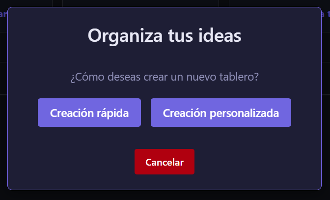
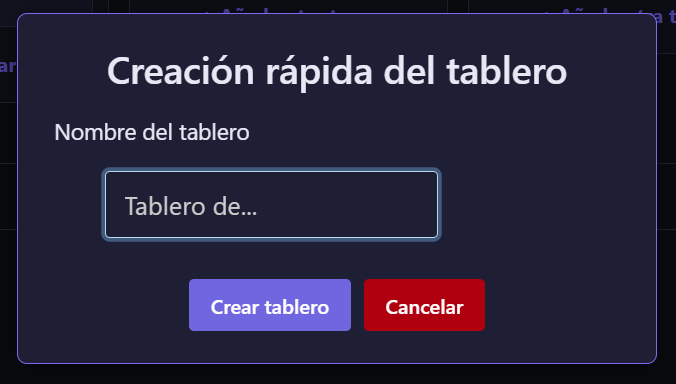
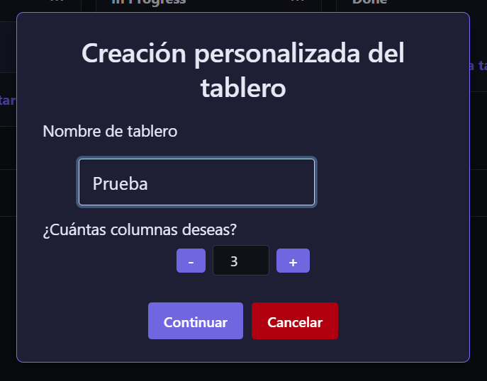
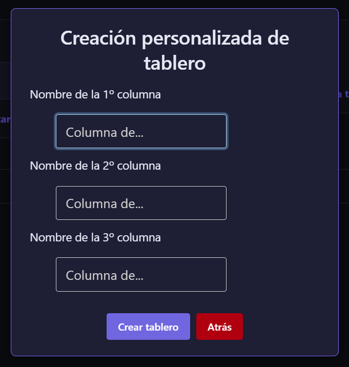
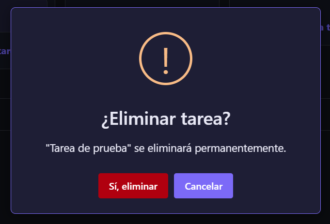
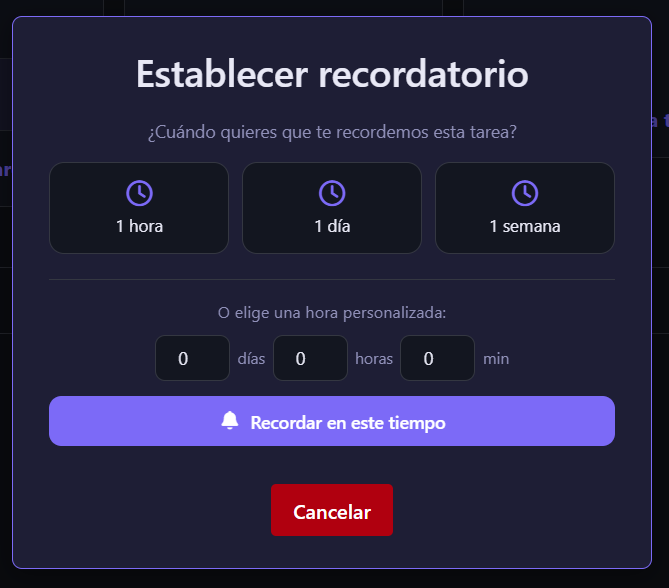
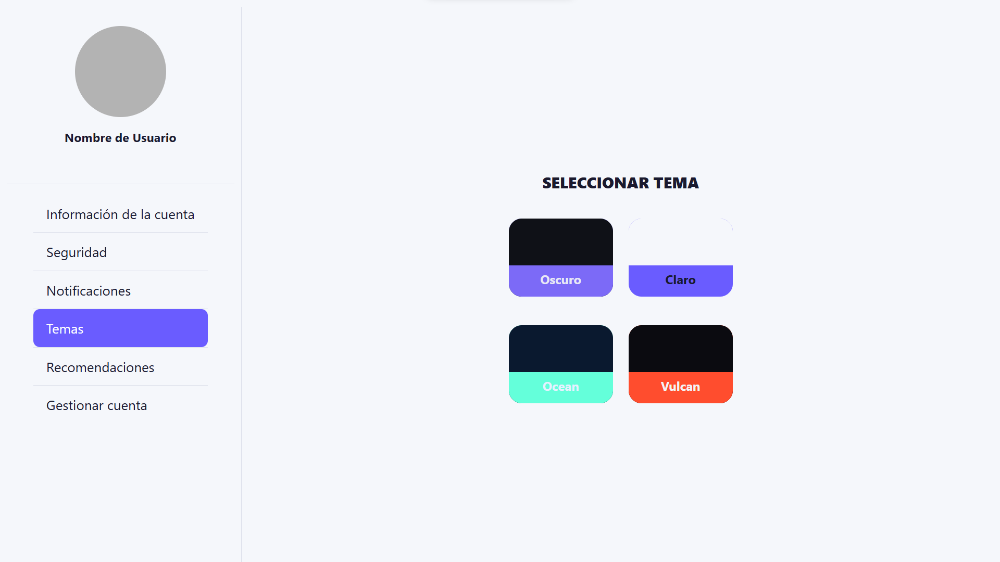
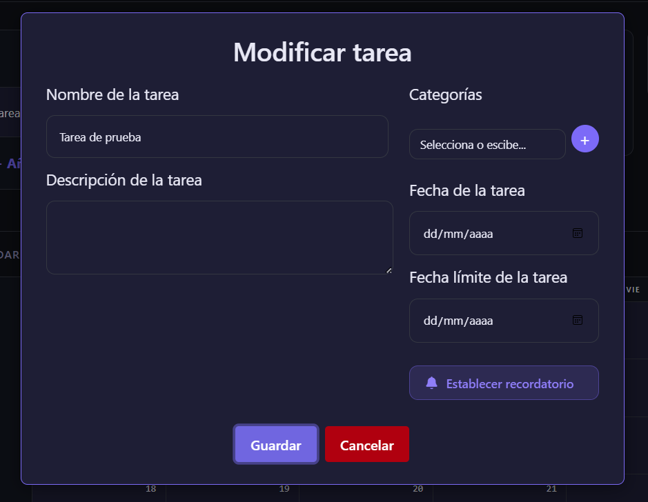

# Jikan
<p align="center">
    
</p>

## Índice
- [Índice](#índice)
- [Introducción](#introducción)
- [Despliegue](#despliegue)
- [Sprint Zero](#sprint-zero)
- [Sprint 1](#sprint-1)
- [Vista previa](#vista-previa)

## Introdución
Jikan, consiste en una aplicación web dedicada a la gestión y organización de tareas, así mismo y como diferencia del resto de aplicaciones del estilo, busca hacer sentir al usuario recompensado por completar sus tareas, mediante un sistema de gamificación. 

La inspiración inicial viene del método “Kanban” para gestionar proyectos y tareas de forma visual y cómoda, ofreciendo un sitio totalmente centralizado con todas las herramientas de productividad oportunas para organizar las diferentes tareas del usuario (tableros separados para diferentes contextos, calendario de tareas, alertas de tareas…).

## Despliegue
Para lanzar la aplicación es necesario contar con Docker, ya que la aplicación se despliega en contenedores para cada uno de sus componentes que se dividen en:
- **backend**: Contiene todos los endpoints y conexiones a la base de datos, para que los cambios sean persistentes.
- **frontend**: Contiene los ficheros que ve el usuario y permiten interactuar con la aplicación.
- **mysql/db**: Construye una base de datos MySQL y contiene todos los ficheros para que la base de datos genere las tablas y los datos iniciales.

Para realizar el despliegue se usa el siguiente comando:
```bash
docker compose up --build
```

Para acceder al despliegue de la aplicación se puede hacer desde esta dirección URL:
```bash
http://localhost:8080
```

Si por algún error necesitas resetear los contenedores, habría que usar el siguiente comando:
```bash
docker compose down -v
```

## Sprint Zero
Para este sprint lo que se hizo fue lo siguiente:

Historias técnicas:
- **HT-01:** Desarrollar mockups.
- **HT-02:** Implementar mockups.

Historias de usuario:
- **HU-01:** Añadir tarea.
- **HU-02:** Eliminar tarea.
- **HU-03:** Cambiar estado de una tarea.
- **HU-04:** Modificar tarea.
- **HU-06:** Mover tarea.

## Vista previa del Sprint Zero
### index.html


### login.html


### register.html


### user-profile.html


## Sprint 1
Para este sprint lo que se hizo fue lo siguiente:

Historias técnicas:
- **HT-03:** Implementar diseño responsive.

Historias de usuario:
- **HU-05:** Crear tablero.
<p align="center">
    
    <p align="center">Popup principal de creación del tablero.</p>
</p>
<p align="center">
    
    <p align="center">Creación rápida del tablero.</p>
</p>
<p align="center">
    
    <p align="center">Creación personalizada del tablero (pantalla 1).</p>
</p>
<p align="center">
    
    <p align="center">Creación personalizada del tablero (pantalla 2).</p>
</p>

- **HU-07:** Editar un tablero.
- **HU-08:** Eliminar un tablero.
<p align="center">
    
    <p align="center">Ejemplo de díalogo de eliminar.</p>
</p>

- **HU-09:** Crear una cuenta de usuario.
- **HU-10:** Iniciar sesión de cuenta de usuario.
- **HU-11:** Cerrar sesión de usuario.
- **HU-12:** Eliminar una cuenta de usuario.
- **HU-15:** Establecer una fecha a una tarea.
- **HU-16:** Establecer una fecha límite a una tarea.
- **HU-17:** Establecer recordatorios a una tarea.
<p align="center">
    
    <p align="center">Creación del recordatorio de una tarea.</p>
</p>

- **HU-18:** Establecer categorías a una tarea.
- **HU-19:** Establecer temas de colores.
<p align="center">
    
    <p align="center">Selector de temas en el perfil de usuario.</p>
</p>

- **HU-20:** Colapsar el calendario.
- **HU-21:** Acciones de deshacer.
- **HU-22:** Establecer descripción a una tarea.
<p align="center">
    
    <p align="center">Nuevo díalogo de modificar tarea.</p>
</p>